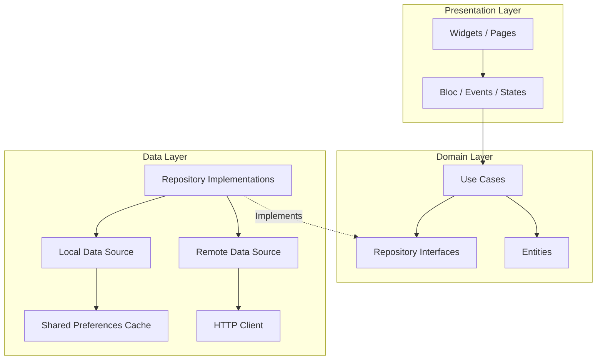

# 🚀 Aura CRM (Nexus CRM)

A premium, modern, and high-performance Customer Relationship Management (CRM) application built with Flutter. Orchestrated using professional **Feature-First Clean Architecture** principles and robust **BLoC (Business Logic Component)** state management.

---

## 📱 Screenshots & Demo Video

### Application Screenshots
To explore the high-fidelity UI layouts of Aura CRM, you can view the individual screenshots hosted on Google Drive:
* **[📱 Splash Screen](https://drive.google.com/file/d/1FUf2qCJFipEpRnl_9Z9JdwAyharMD97s/view?usp=sharing)**
* **[🔑 Sign In Screen](https://drive.google.com/file/d/1Xkgi6PLKfQtmhsYdiM6j4V5Xg83vII4q/view?usp=sharing)**
* **[📊 CRM Dashboard](https://drive.google.com/file/d/1emLvWVhBkJ4k9VRZ23SGZMcPFKVTiIbI/view?usp=sharing)**
* **[🏢 Companies List](https://drive.google.com/file/d/1sCqNwmnV6mijzw2Alb2zs8mJpRmWLrFo/view?usp=sharing)**
* **[🔍 Company Details](https://drive.google.com/file/d/1u3Muoh1_d5ynMsYVktFMOa1puU7xWJNp/view?usp=sharing)**

### 🎥 Project Walkthrough Video
> [!NOTE]
> Since the project video (`crmVideoFinal.webm`) is a high-resolution 70MB recording, it is hosted on Google Drive rather than checked directly into the Git repository to avoid repository bloat.
> 
> **[▶ Watch the Full Demo Video on Google Drive](https://drive.google.com/file/d/1j472loc7V7r7lE5vS5XZGOogKv0OXjZs/view?usp=sharing)**

---

## 🏢 Architectural Design: Feature-First Clean Architecture

Aura CRM is structured using a **Feature-First Clean Architecture** pattern. By separating the codebase into distinct feature modules and isolating them into independent layers, we achieve a highly decoupled, modular, testable, and scalable framework. This design is highly concurrent, enabling multiple developers to work on separate modules without code conflicts.

### The Three Isolated Layers

Each feature module is split into three strict layers, following the dependency flow: **Presentation ➔ Domain ➔ Data** (Domain remains completely independent at the center).



1. **Domain Layer (Core Business Logic)**
   * **Entities**: Pure Dart classes representing core business data (e.g., `Company`). Completely independent of any database or UI frameworks.
   * **Use Cases**: Encapsulate specific business rules and operations (e.g., `GetCompanies`).
   * **Repository Interfaces**: Define contracts for data operations, enabling strict dependency inversion.

2. **Data Layer (Data Operations & Mapping)**
   * **Models**: Extend Domain Entities to add JSON serialization/deserialization logic (`fromJson`, `toJson`).
   * **Data Sources**: Perform actual HTTP REST requests or local storage caching operations.
   * **Repository Implementations**: Coordinate remote and local data sources, handling offline caching fallback logic.

3. **Presentation Layer (UI & State Coordination)**
   * **BLoCs**: Manage events and yield states to control the user interface.
   * **Pages / Views**: High-fidelity, reactive user interfaces governed by standard **`<60-line code constraints`** for container widgets. View layouts delegate to modular, extracted child components to guarantee maintainability.

---

## 📂 Modular Folder Structure

The directory structure is organized "feature-first" to ensure that adding or modifying features requires touching code in only one cohesive folder.

```text
lib/
├── app/
│   ├── routes/              # Navigation configurations using go_router
│   └── app.dart             # Global MultiBlocProvider & MaterialApp styling setup
├── core/
│   ├── config/              # Environment configs, dev/prod schemes, and configurations
│   ├── constants/           # Global colors, dimensions, keys, and asset paths
│   ├── localization/        # Multi-language localization engine (e.g., LocaleBloc)
│   ├── network/             # Core HttpClient wrapping network connection checking
│   ├── theme/               # Harmonious modern light/dark typography & themes
│   ├── utils/               # Shared helper tools (formatting, validators)
│   └── widgets/             # Globally reusable UI blocks (Loader, CustomTextForm)
└── features/
    ├── splash/              # Startup boot orchestrator
    │   └── presentation/    # Splash state handling and initialization UI
    ├── auth/                # Authentication Feature Module
    │   ├── data/            # Data Sources, Auth Request/Response Models
    │   ├── domain/          # Authentication Entities and Use Cases
    │   └── presentation/    # Login forms, BLoC, and state-specific widgets
    ├── dashboard/           # Dashboard Feature Module
    │   ├── data/            # Mock analytics & meeting schedules
    │   └── presentation/    # Metric Cards, Meeting lists, Activity charts
    └── companies/           # Companies Feature Module
        ├── data/            # Local/Remote Data Sources, Models, Address mapping
        ├── domain/          # Company Entity, Repositories, Fetch Use Cases
        └── presentation/    # List Coordinators, Detail Pages, BLoC, and Search views
```

---

## ⚡ State Management Choice & Justification

We utilize **`flutter_bloc`** as our primary state management engine.

```text
                  [User Interaction]
                          │
                          ▼ (Dispatches)
                    ┌───────────┐
                    │  Events   │
                    └─────┬─────┘
                          │
                          ▼ (Processes in)
                    ┌───────────┐
                    │   BLoC    │
                    └─────┬─────┘
                          │
                          ▼ (Emits)
                    ┌───────────┐
                    │  States   │
                    └─────┬─────┘
                          │
                          ▼ (Triggers)
                   [UI Redraw / Build]
```

### Why BLoC?
* **Predictable & Unidirectional Data Flow:** Data moves in a single direction. The UI dispatches **Events**, the **BLoC** executes business logic, and yields new **States**. This eliminates race conditions and side effects.
* **100% UI-Logic Separation:** Business logic contains zero references to Flutter widgets, meaning it can be effortlessly tested using clean Dart unit tests.
* **Selective Rebuilding (Performance):** Stream-based architecture ensures that only components wrapped inside specific `BlocBuilder` widgets will rebuild, maximizing rendering speeds and maintaining smooth 60fps/120fps animations.
* **Predictable Offline/Online States:** Readily manages loading states, pagination statuses, connectivity transitions, and search filters under unified state structures.

---

## 📦 Packages Used

The application relies on a curated set of high-quality, lightweight packages to maximize stability and minimize dependency bloat:

| Package | Version | Purpose |
| :--- | :--- | :--- |
| **`flutter_bloc`** | `^9.1.1` | Robust, unidirectional event-to-state management framework. |
| **`go_router`** | `^17.2.3` | Path-based, declarative routing for dynamic navigation and transitions. |
| **`http`** | `^1.6.0` | High-performance, asynchronous REST HTTP client. |
| **`shared_preferences`** | `^2.5.5` | Lightweight local disk-based persistence used for caching API data offline. |
| **`cupertino_icons`** | `^1.0.8` | High-fidelity assets supporting visual UI iconography. |

---

## ⚖️ Architectural Tradeoffs Made

### 1. Simple Cache Persistence (`shared_preferences`) vs. Database Engines (`SQLite` / `Hive`)
* **Tradeoff:** We chose `shared_preferences` to serialize and cache company records as a JSON string rather than spinning up a complex SQL database or Hive box.
* **Justification:** Given the moderate size of the API payloads (up to ~100 records), string-serialization inside SharedPreferences is extremely fast, demands zero boilerplate setup, has a tiny footprint, and requires no complicated database migrations. As records scale past thousands, migrating the local data source to SQLite or Floor can be done instantly without breaking Domain or Presentation layers due to clean architectural boundaries.

### 2. Client-Side Data Enrichment
* **Tradeoff:** The underlying mock JSON APIs (e.g. JSONPlaceholder) return basic fields. We dynamically enrich these objects during the **Data Mapping** phase with realistic avatars, company statuses (`Active`, `Pending`, `Inactive`), color tags, and coordinates.
* **Justification:** Performing enrichment inside the repository mapper layer keeps UI-specific generation out of the Presentation views while enabling us to render high-fidelity dashboards with beautiful statuses and badges.

### 3. Client-Side List Filtering & Search
* **Tradeoff:** For search and status segmentation (e.g. tabs), we query the companies list once and perform queries and segment filtering locally inside the `CompaniesBloc`.
* **Justification:** Local filtering yields instantaneous search feedback with zero typing latency or multiple HTTP round-trips. However, this is structured using queries that can be easily mapped to API parameters (e.g. `?q=search`) if server-side filtering is required in the future.

### 4. Modular Code Size Restrictions (`<60 lines` code constraint)
* **Tradeoff:** We strictly limit container widgets and screen coordinators to under 60 lines, forcing the extraction of child widgets into dedicated sub-widgets.
* **Justification:** While this slightly increases the number of files in the presentation package, it makes complex pages exceptionally readable, easier to test, and prevents the "nested-column hell" typical of rapid Flutter code.

---

## 🚀 How to Run the Project

Follow these steps to set up, build, and run the project locally.

### 1. Prerequisites
Ensure you have the Flutter SDK installed on your system.
```bash
flutter doctor
```

### 2. Dependency Setup
Fetch all dependencies required for the project:
```bash
flutter pub get
```

### 3. Running Static Code Verification
We enforce zero-warning static analysis checks across the codebase. Verify code styling and correctness using:
```bash
flutter analyze
```

### 4. Running Tests
Run our comprehensive test suite containing unit tests, BLoC tests, and widget tests:
```bash
flutter test
```

### 5. Running the Application
Launch the application on your connected device or simulator in debug mode:
```bash
flutter run
```
*Note: To target specific configurations or run on desktop platforms, you can use `flutter run -d <device_name>`.*
